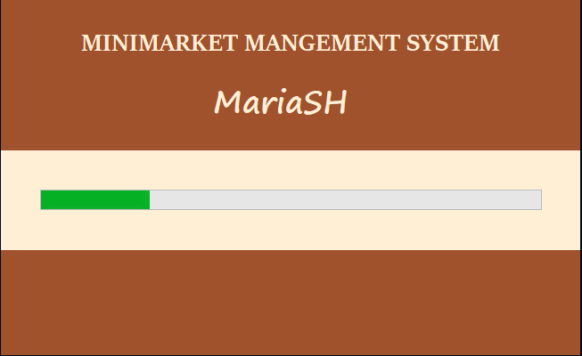
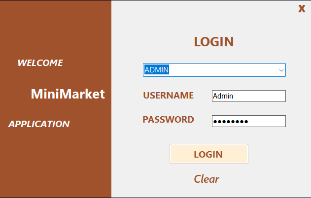
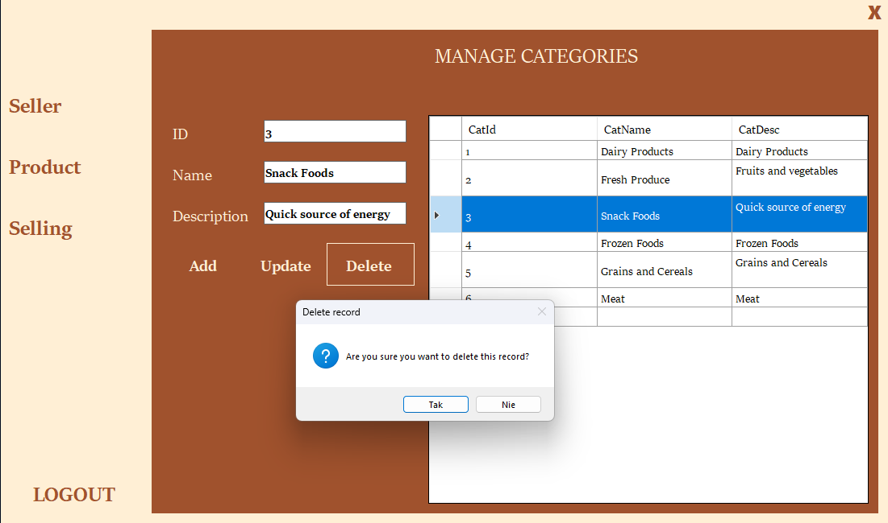
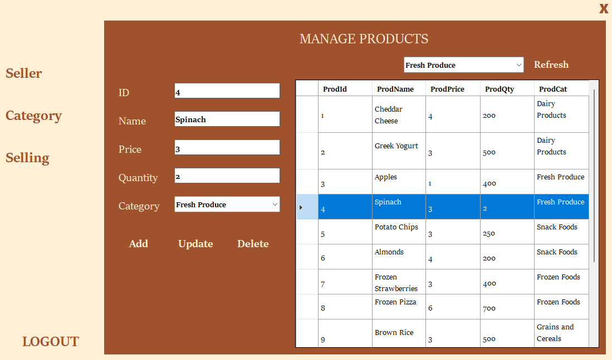
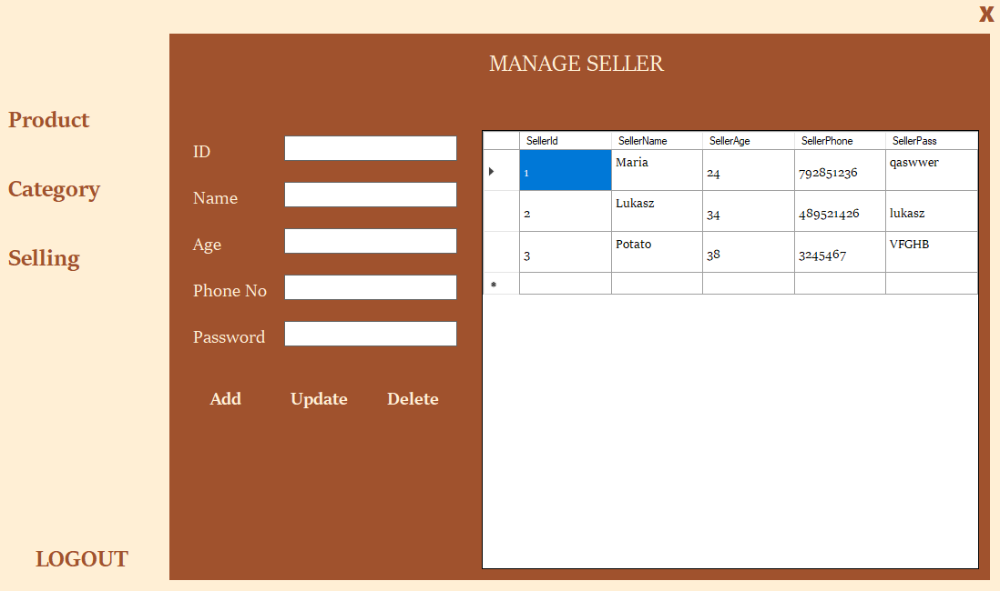
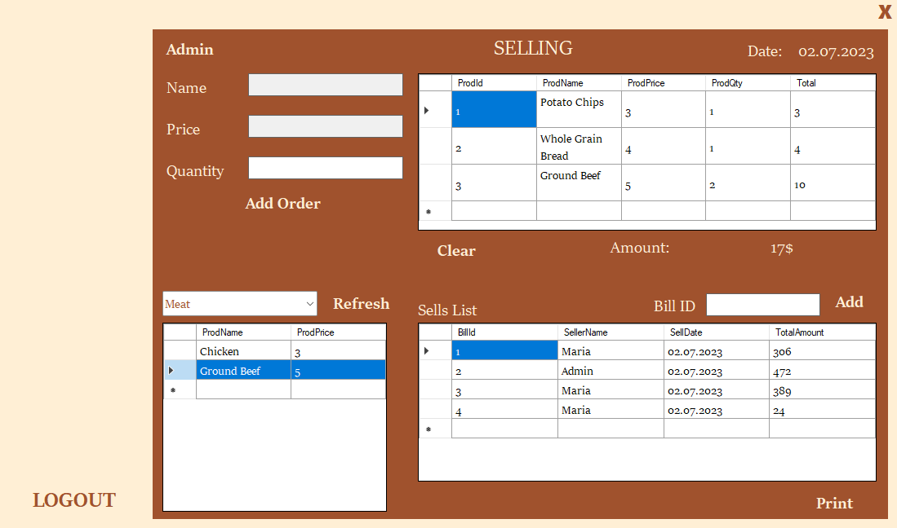

# Minimarket Managment System
## Project Description:
The project includes the following forms:
- Login Form
- Manage Categories Form
- Manage Products Form
- Manage Seller Form
- Sellings Form

As an Admin, you can manage product categories, available products, list of sellers and their orders.

As a Seller, you can place an order, view your order history and print an order report.
## What I learned 
In the process of creating this project, I learned :
- how to make detailed window project in VS,
- how to use SQL databases for store data,
- the commands used to handle events in C#.
## Screenshots

